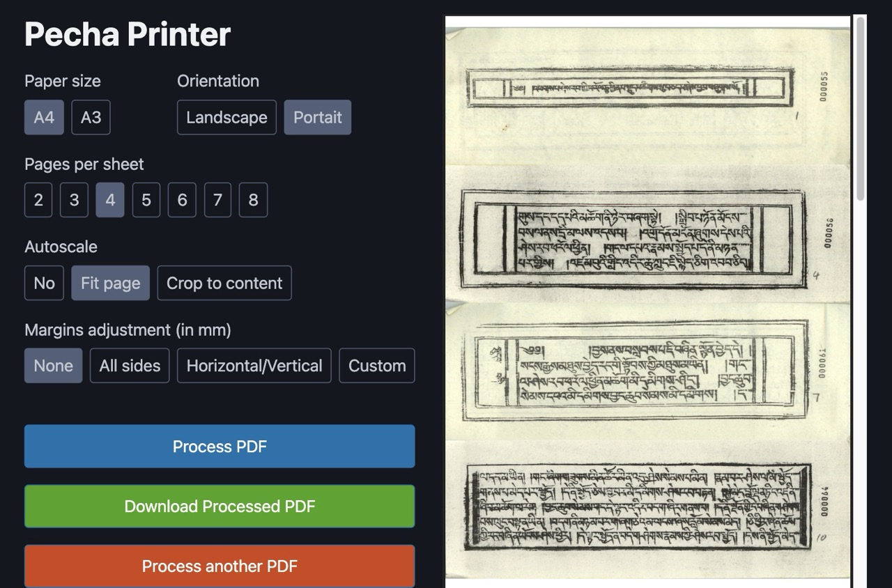

# Pecha Printer

Print your pecha PDFs, cut and stack them only once instead of manually reordering pages one by one.



## Requirements (pdfjam, poppler, podofocrop)

```bash
sudo apt install texlive-extra-utils poppler-utils podofo-utils
```
